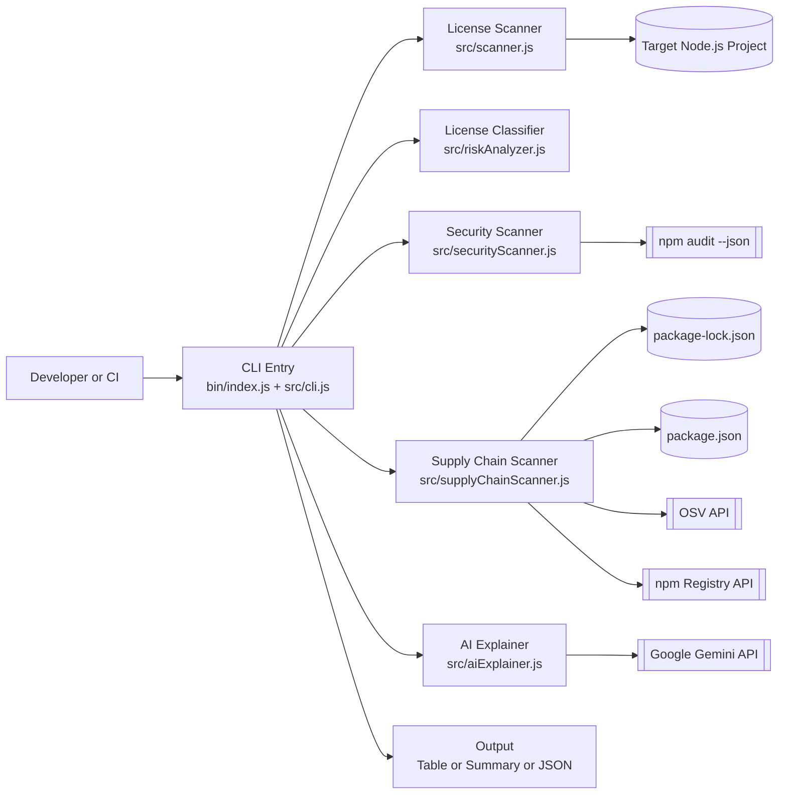
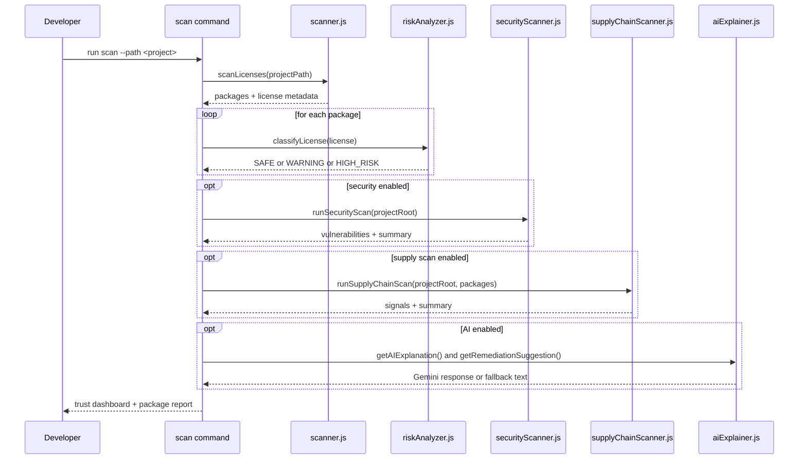

# Dependency Trust Analyzer Architecture

## Tech Icons (skillicons.dev)

## System Objective

The CLI evaluates dependency trust across three risk planes:

- License/compliance risk
- Security vulnerability risk (npm audit)
- Supply-chain trust risk (OSV + package metadata + lockfile integrity)

It then calculates per-package trust scores and a unified project trust score.

## Layered Architecture

1. Entry and Orchestration Layer

- `bin/index.js`: executable shim for global/local CLI usage.
- `src/cli.js`: command definitions, scan pipeline orchestration, output rendering.

2. Analysis Layer

- `src/scanner.js`: dependency/license discovery via license-checker.
- `src/riskAnalyzer.js`: rule-based license risk classifier.
- `src/securityScanner.js`: npm audit parser and normalized vulnerability model.
- `src/supplyChainScanner.js`: heuristic and metadata-based supply-chain signals.

3. Intelligence Layer

- `src/aiExplainer.js`: AI explanations and remediation (Gemini), with deterministic fallback.

4. Presentation Layer

- Rich terminal dashboards and optional JSON output for automation.

## Component Diagram

## Scan Sequence Diagram

## Trust Scoring Model

Package trust starts at 100 and subtracts penalties:

- License penalty
  - HIGH_RISK: 45
  - WARNING: 18
  - SAFE: 0
- Vulnerability penalty
  - critical: 30, high: 20, moderate: 10, low: 4, info: 2
  - capped at 70 total
- Supply-chain penalty
  - high: 15, moderate: 8, low: 4
  - capped at 40 total

Overall project trust is derived from average package trust, then reduced by:

- 2 points per critical vulnerability
- rounded ecosystem supply penalty contribution

Final score is clamped to 0..100 and mapped to bands: Strong, Watch, High Caution, Critical.

## Environment and Config

- The CLI loads environment values via dotenv at startup.
- `.env.example` provides the canonical template.
- `GEMINI_API_KEY` enables live AI explanations and remediation suggestions.
- Without an API key, the tool remains fully functional using built-in fallback content.

## Important Runtime Notes

- Supply-chain analysis currently runs when either `--security` or `--supply-chain` is enabled.
- Security scan handles both npm 6 and npm 7+ audit JSON formats.
- Supply-chain scanner supports npm v6 and v7+ lockfile structures.

## Extension Points

- Add new license policy rules in `src/riskAnalyzer.js`.
- Add new supply heuristics/signals in `src/supplyChainScanner.js`.
- Tune trust-scoring weights in `src/cli.js`.
- Expand AI fallback coverage in `src/aiExplainer.js`.
