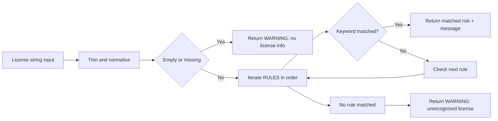

# Flow and License Rules Configuration

## Icons and Badges

[](https://nodejs.org/)
[](https://developer.mozilla.org/en-US/docs/Web/JavaScript)
[](https://www.npmjs.com/)
[](https://mermaid.js.org/)


## Purpose

This guide explains:

- The runtime scan flow in the CLI
- How license rules are evaluated
- How to safely configure or extend license rules

## Runtime Flow

Primary flow starts in [src/cli.js](src/cli.js), then orchestrates scanner modules.

```mermaid
flowchart TD
    A[Run scan command] --> B[Resolve project root]
    B --> C[Step 1: scanLicenses]
    C --> D[Step 2: classifyLicense for each package]

    D --> E{--security enabled}
    E -- Yes --> F[Step 3: runSecurityScan]
    E -- No --> G[Skip security scan]

    F --> H{withSupply = security OR supply-chain}
    G --> H
    H -- Yes --> I[Step 4: runSupplyChainScan]
    H -- No --> J[Skip supply-chain scan]

    I --> K{AI enabled}
    J --> K
    K -- Yes --> L[Step 5: AI explanations]
    L --> M[Step 6: remediation + trust dashboard]
    K -- No --> M

    M --> N{Output mode}
    N -- --json --> O[Emit structured JSON]
    N -- --summary --> P[Print summary boxes]
    N -- default --> Q[Print full package report]
```

## License Rule Evaluation Logic

Rules are configured in [src/riskAnalyzer.js](src/riskAnalyzer.js) as an ordered array named RULES.



### Current Precedence Design

- LGPL warning rules are intentionally before GPL high-risk rules.
- This prevents accidental substring collision such as LGPL-3.0 matching GPL-3.0 first.
- Overall practical order is:
  - WARNING (LGPL)
  - HIGH_RISK (GPL and AGPL)
  - WARNING (MPL, EPL, CDDL, Unknown)
  - SAFE (MIT, Apache, BSD, ISC, and similar)

Source reference: [src/riskAnalyzer.js](src/riskAnalyzer.js).

## How to Configure License Rules

### Rule Shape

Each rule entry uses this shape:

```js
{
  risk: "SAFE" | "WARNING" | "HIGH_RISK",
  keywords: ["KEYWORD_A", "KEYWORD_B"],
  message: "Human-readable explanation"
}
```

### Add a New Rule

1. Open [src/riskAnalyzer.js](src/riskAnalyzer.js).
2. Add a new rule object inside RULES.
3. Place it by intended precedence:
   - More sensitive matches should be earlier.
4. Keep message concise because it is shown in CLI output.
5. Run a scan against a project that includes the target license.

### Example: Add an Internal Policy Warning

```js
{
  risk: "WARNING",
  keywords: ["BUSL-1.1", "Business Source License"],
  message:
    "Restricted commercial use conditions may apply. Review policy before shipping."
}
```

Recommended placement:

- Put this above SAFE rules so restrictive terms are not treated as permissive by fallback assumptions.

## Safety Checklist for Rule Changes

- Confirm no unintended substring collisions.
- Keep high-impact rules above broad permissive rules.
- Validate at least one known sample for each modified keyword.
- Verify summary counts still align with expected output.

## Related Docs

- Architecture overview: [ARCHITECTURE.md](ARCHITECTURE.md)
- Project usage and options: [README.md](README.md)
